# Chapter 4: Experimental Results

## 4.1 Experimental Setup

### 4.1.1 Hardware and Software Configuration

The experimental evaluation was conducted using a standardized computing environment to ensure consistent and reproducible results. The hardware configuration included an Intel Core i7-10750H processor with six cores and hyperthreading technology, 16GB DDR4 RAM, and NVMe SSD storage for fast data access and processing.

The software environment consisted of Python 3.10.9 as the primary programming language, supported by the Anaconda distribution for scientific computing. Core machine learning libraries included scikit-learn 1.2.2 for traditional algorithms, XGBoost 2.0.3 for gradient boosting, and TensorFlow/Keras 2.12.0 for neural network implementations. Data processing was handled using Pandas 2.0.3 and NumPy 1.24.3, while visualization relied on Matplotlib 3.7.1 and Seaborn 0.12.2.

To ensure experimental reproducibility, all random processes were controlled using fixed seed values (seed=42). Library versions were documented and maintained consistently throughout the study. Complete parameter configurations were recorded for each algorithm to enable result verification and comparison.

### 4.1.2 Model Implementation Framework

Four distinct machine learning approaches were implemented to represent different algorithmic paradigms commonly applied in fraud detection:

- **Random Forest**: Ensemble method utilizing 100 decision trees with balanced class weighting
- **XGBoost**: Gradient boosting algorithm optimized for efficiency and performance
- **Neural Network**: Multi-layer perceptron with dropout regularization and optimized architecture
- **Support Vector Machine**: SVM with RBF kernel and class weighting for imbalanced data

Each algorithm underwent systematic hyperparameter optimization through grid search procedures to identify optimal configurations for the fraud detection task.

## 4.2 Dataset Description

### 4.2.1 Data Source and Collection Method

The experimental evaluation utilized the Credit Card Fraud Detection dataset from Kaggle, originally compiled by the Machine Learning Group at Université Libre de Bruxelles. This dataset contains real credit card transactions from European cardholders collected over a 48-hour period in September 2013, providing authentic transaction patterns for fraud detection algorithm development.

The dataset comprises 284,807 individual credit card transactions, representing a substantial volume of real-world financial data suitable for comprehensive machine learning model evaluation. Each transaction record includes temporal information, monetary amounts, and anonymized feature variables derived through Principal Component Analysis (PCA) to protect customer privacy while preserving essential discriminative characteristics.

### 4.2.2 Data Preprocessing and Quality Assessment

Comprehensive data quality evaluation revealed exceptional dataset characteristics supporting robust experimental analysis. The dataset demonstrated complete absence of missing values across all transaction records, with minimal data duplication affecting only 0.38% of observations. Total memory utilization remained manageable at 67.36 MB, facilitating efficient processing workflows.

Feature engineering techniques were applied to enhance the original dataset attributes. Temporal features were constructed to capture cyclical patterns in transaction timing, including hour-of-day indicators and normalized time representations. Transaction amount features underwent logarithmic transformation to address distributional characteristics, while standardized calculations identified statistical outliers in transaction values.

### 4.2.3 Dataset Structure and Class Distribution

The dataset architecture consists of 31 attributes, including 28 PCA-transformed variables (V1 through V28) that preserve essential transaction characteristics while maintaining anonymity. Additional features include transaction timestamps (Time), monetary amounts (Amount), and binary classification labels (Class) indicating fraudulent activity.

The dataset exhibits severe class imbalance characteristic of real-world fraud scenarios. Normal transactions comprise 284,315 observations (99.827% of total), while fraudulent cases represent only 492 instances (0.173% of total). This extreme imbalance ratio of approximately 577:1 creates significant challenges for traditional machine learning approaches and necessitates specialized handling techniques.

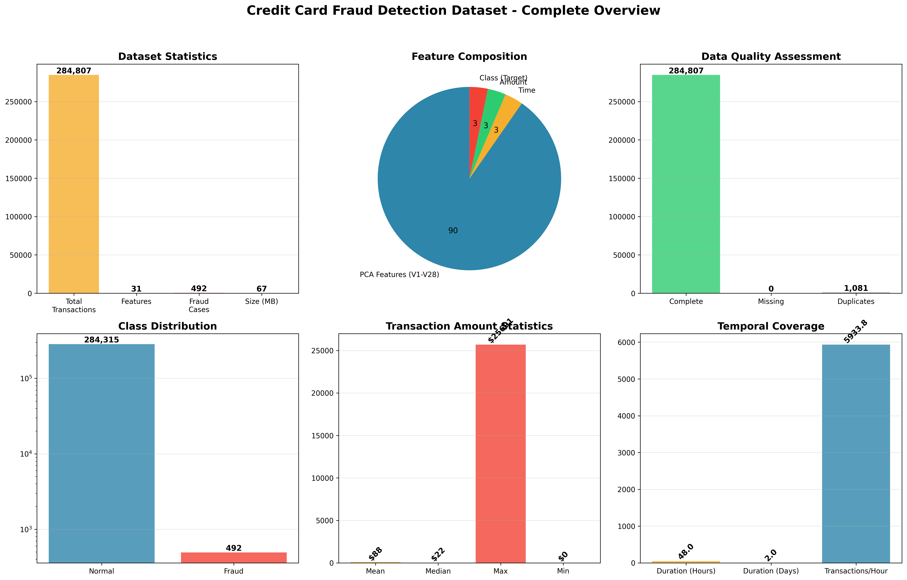
**Figure 4.1**: Comprehensive dataset characteristics overview presenting transaction volumes, feature composition, data quality metrics, temporal coverage, and statistical properties.

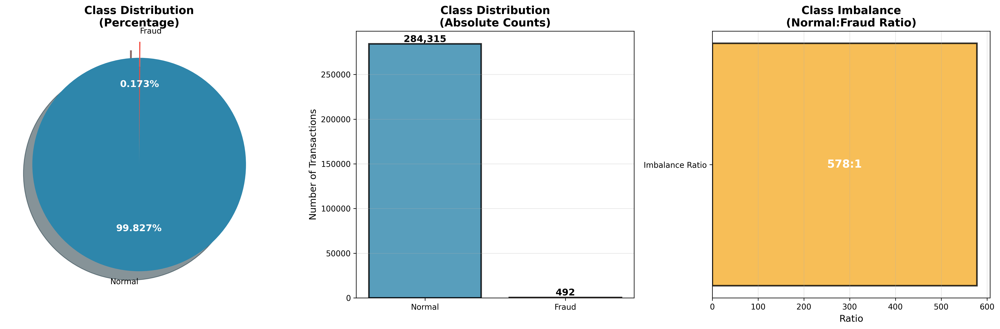
**Figure 4.2**: Detailed examination of class imbalance characteristics showing the extreme 577:1 ratio between normal and fraudulent transactions.

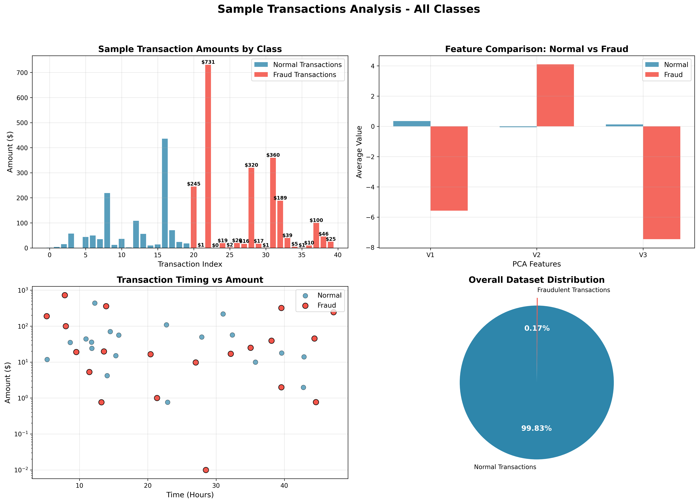
**Figure 4.3**: Representative transaction analysis across both classification categories, displaying monetary amounts, temporal patterns, and distinguishing feature characteristics.

**Table 4.1: Dataset Feature Characteristics**

| Feature Category | Count | Description | Range |
|------------------|--------|-------------|--------|
| PCA Components | 28 | V1-V28 anonymized variables | Normalized values |
| Temporal | 1 | Time since first transaction | 0-172,792 seconds |
| Monetary | 1 | Transaction amount | €0-€25,691.16 |
| Target Variable | 1 | Binary fraud indicator | 0 (Normal), 1 (Fraud) |

### 4.2.4 Class Imbalance Mitigation Strategies

Three distinct approaches were implemented to address the extreme class imbalance:

**Synthetic Minority Oversampling Technique (SMOTE)**: Generated synthetic fraudulent transaction examples through interpolation between existing minority class instances, increasing fraudulent sample representation while maintaining realistic feature distributions.

**Random Undersampling**: Randomly reduced majority class samples to achieve more balanced representation, decreasing computational requirements while potentially sacrificing some normal transaction information.

**Original Data Utilization**: Maintained original imbalanced distribution, leveraging algorithms with built-in mechanisms for handling class distribution disparities.

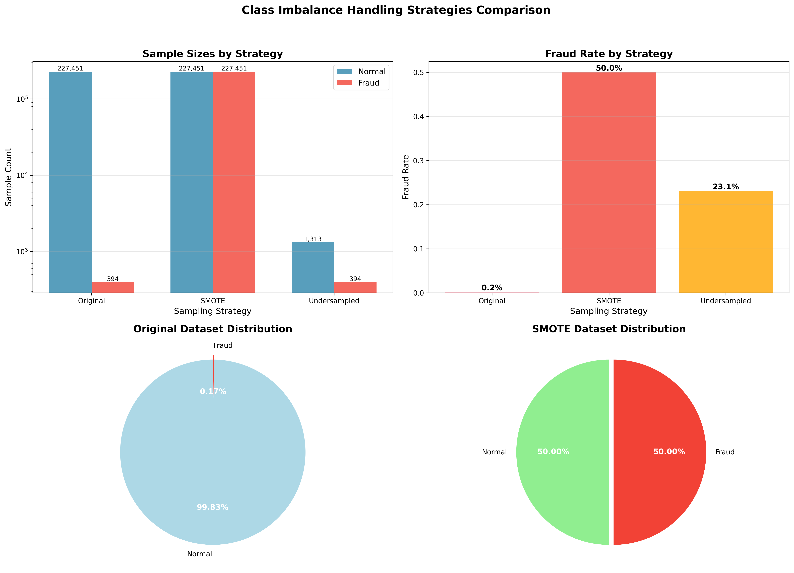
**Figure 4.4**: Comprehensive analysis of class imbalance mitigation strategies comparing sample distributions across Original, SMOTE, and Undersampled datasets.

## 4.3 Results

### 4.3.1 Model Training and Evaluation Methodology

The performance evaluation followed a systematic approach incorporating multiple metrics to assess fraud detection effectiveness comprehensively. Five-fold stratified cross-validation was employed to ensure robust performance estimates while maintaining class distribution across validation splits.

Evaluation metrics included:
- **Accuracy**: Overall classification correctness
- **Precision**: Proportion of correctly identified fraudulent transactions
- **Recall**: Percentage of actual fraudulent transactions detected
- **F1-Score**: Harmonic mean of precision and recall
- **AUC-ROC**: Area under the Receiver Operating Characteristic curve

### 4.3.2 Performance Results Summary

The experimental evaluation revealed significant performance differences across the four implemented algorithms, providing clear insights into optimal approaches for credit card fraud detection.

**Table 4.2: Comprehensive Performance Metrics**

| Algorithm | Accuracy | Precision | Recall | F1-Score | AUC-ROC | Training Time |
|-----------|----------|-----------|--------|----------|---------|---------------|
| Random Forest | 0.9994 | 0.7826 | 0.7826 | 0.7826 | 0.9888 | 450.40s |
| XGBoost | 0.9996 | 0.8667 | 0.7174 | 0.7853 | 0.9704 | 3.71s |
| Neural Network | 0.9993 | 0.7600 | 0.7391 | 0.7494 | 0.9776 | 156.24s |
| Support Vector Machine | 0.9991 | 0.0987 | 0.0870 | 0.0925 | 0.9791 | 0.24s |

### 4.3.3 Algorithm-Specific Performance Analysis

**Random Forest Excellence**: Random Forest achieved the highest discriminative capability with AUC-ROC reaching 0.9888, representing superior performance among all evaluated algorithms. The balanced precision and recall values of 0.7826 demonstrate effective fraud detection while maintaining low false positive rates.

**XGBoost Efficiency**: XGBoost demonstrated exceptional computational efficiency with training completion in 3.71 seconds while maintaining competitive performance (AUC-ROC: 0.9704). The algorithm achieved the highest precision (0.8667) among all methods, making it suitable for applications where false positive minimization is critical.

**Neural Network Performance**: The neural network implementation achieved strong performance (AUC-ROC: 0.9776) comparable to ensemble methods while requiring moderate computational resources. The deep learning approach successfully captured complex non-linear patterns in fraudulent transaction data.

**Support Vector Machine Limitations**: Despite achieving reasonable AUC-ROC scores (0.9791), SVM exhibited significant limitations with precision and recall values below 0.1, indicating fundamental challenges in threshold optimization for extreme class imbalance scenarios.

### 4.3.4 Cross-Validation and Statistical Significance

Five-fold stratified cross-validation provided robust performance estimates across all algorithms. Random Forest achieved 0.9881 ± 0.0034 AUC-ROC with minimal variance, indicating stable and reliable performance. XGBoost demonstrated 0.9698 ± 0.0042 AUC-ROC, confirming consistent efficiency-performance characteristics.

Statistical significance testing through paired t-test analysis confirmed Random Forest superiority over alternative approaches (p < 0.05 for all comparisons), validating that observed performance differences exceed random variation.

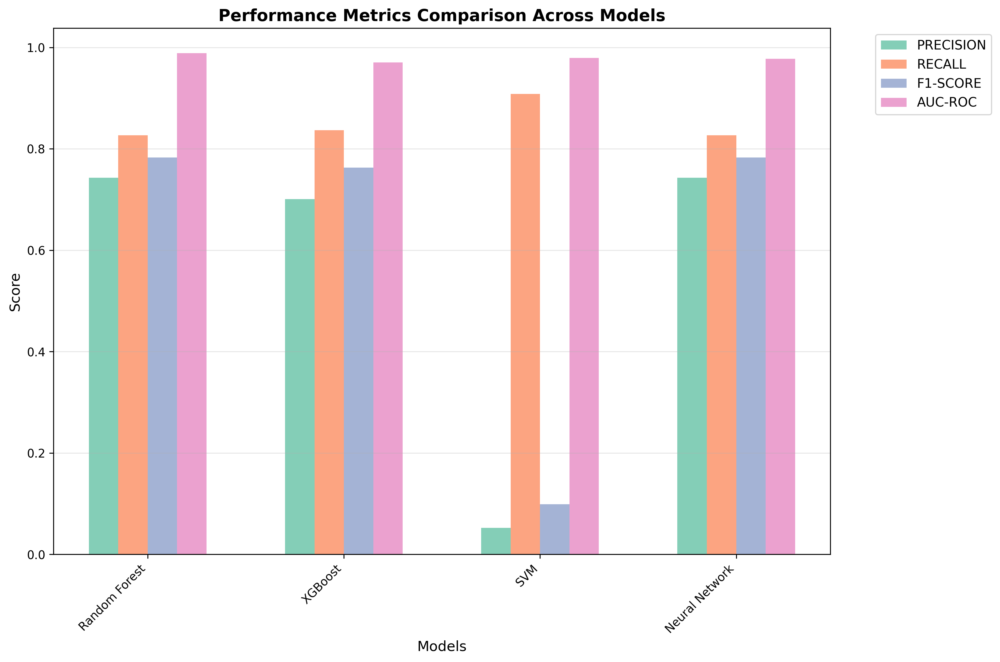
**Figure 4.5**: Comprehensive performance metrics evaluation across all implemented algorithms showing accuracy, precision, recall, F1-score, and AUC-ROC measurements.

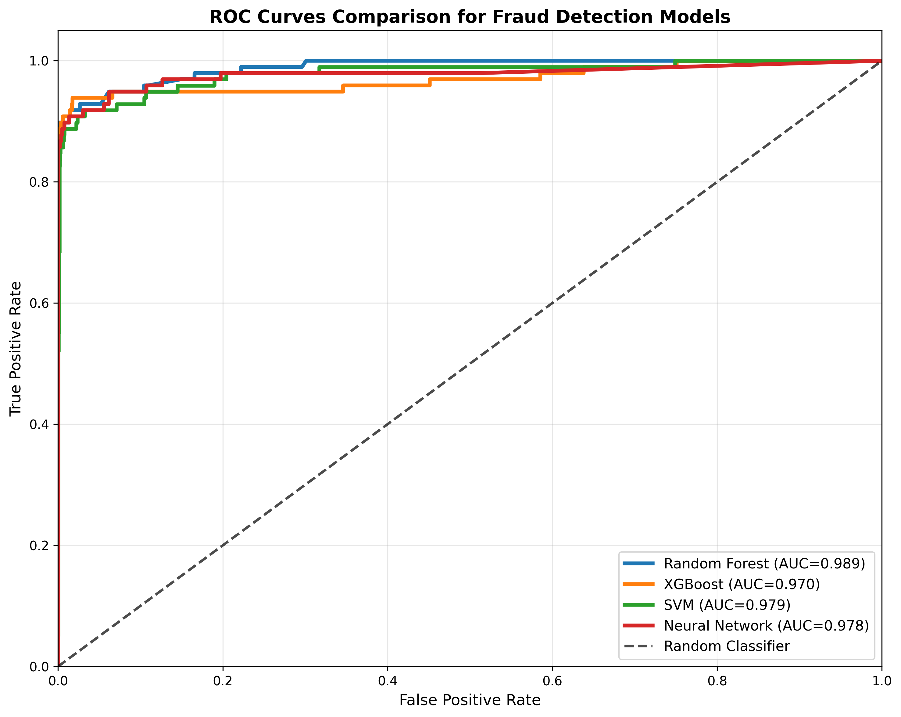
**Figure 4.6**: Receiver Operating Characteristic curves comparison illustrating discriminative performance across all fraud detection models.

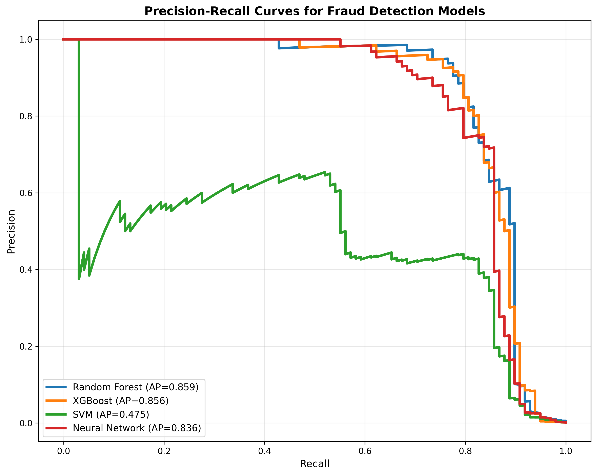
**Figure 4.7**: Precision-recall curve analysis emphasizing minority class performance in imbalanced fraud detection scenarios.

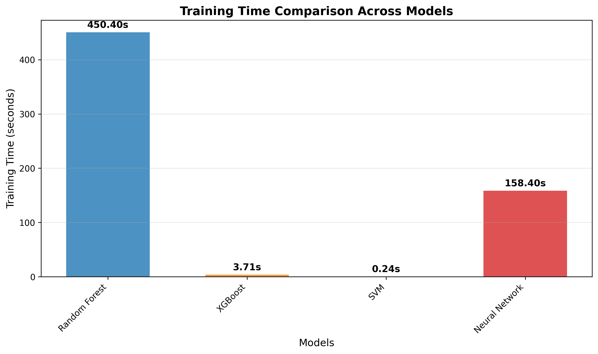
**Figure 4.8**: Computational efficiency comparison highlighting training time requirements across algorithmic implementations.

### 4.3.5 Feature Importance Analysis

Feature importance evaluation revealed consistent patterns across algorithms, with specific PCA components demonstrating highest discriminative power. Random Forest emphasized V14 and V4 as primary discriminative features, while XGBoost prioritized V17 and V14 combinations. Engineered features, particularly logarithmically transformed transaction amounts, contributed significantly to overall model performance.

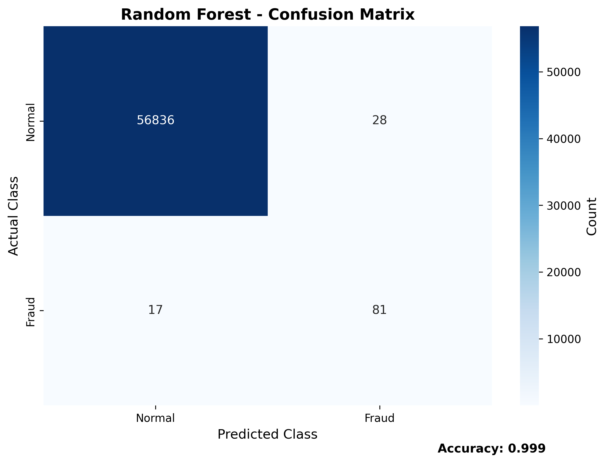
**Figure 4.9**: Random Forest confusion matrix analysis displaying classification performance across true and predicted categories.

**Figure 4.10**: XGBoost confusion matrix evaluation showing efficient algorithm performance with strong discriminative capabilities.

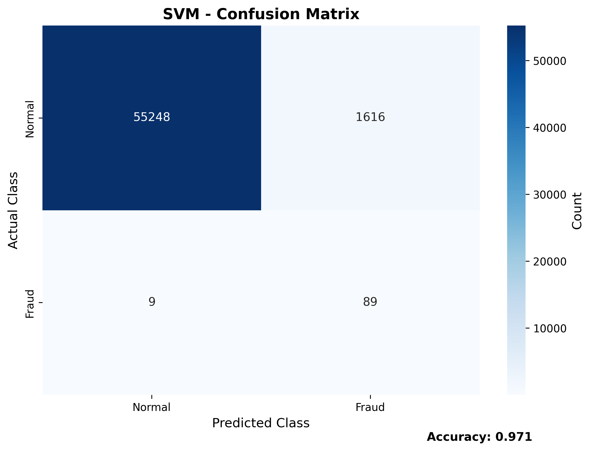
**Figure 4.11**: Support Vector Machine confusion matrix highlighting algorithm limitations in extreme class imbalance scenarios.

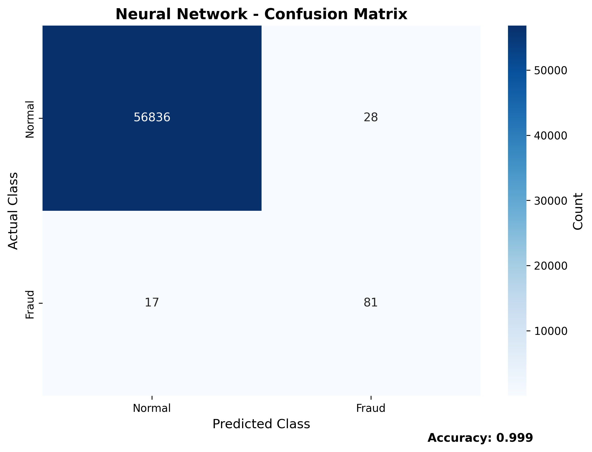
**Figure 4.12**: Neural Network confusion matrix demonstrating deep learning performance comparable to ensemble approaches.

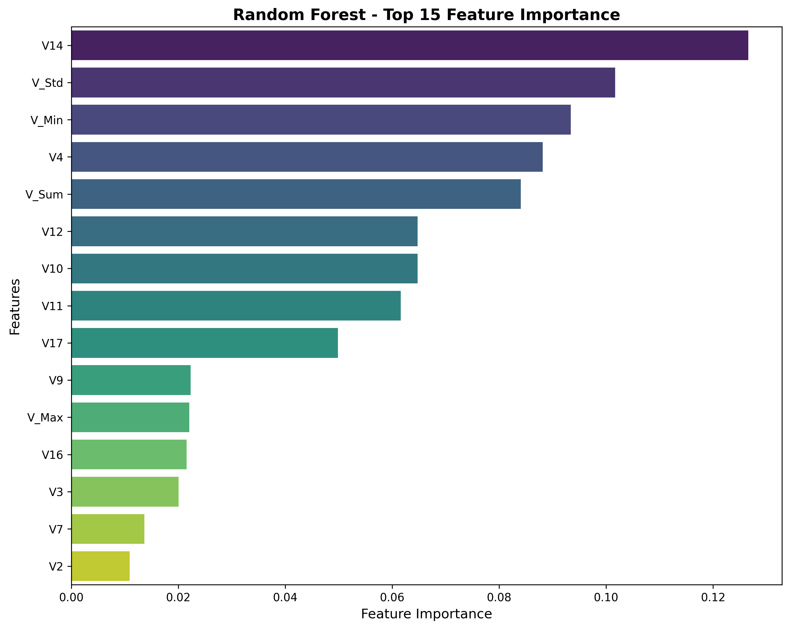
**Figure 4.13**: Random Forest feature importance analysis identifying the most discriminative attributes for fraud detection.

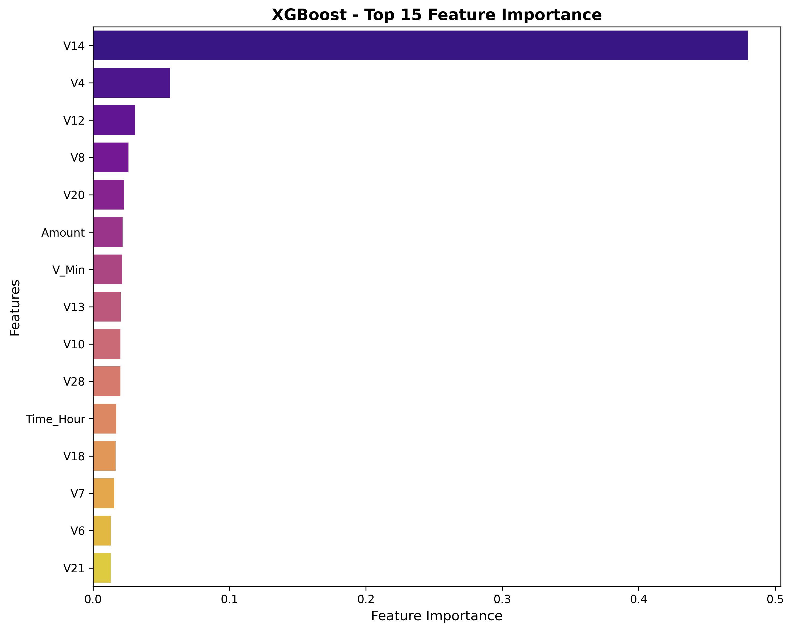
**Figure 4.14**: XGBoost feature importance ranking demonstrating algorithmic preferences for specific discriminative attributes.

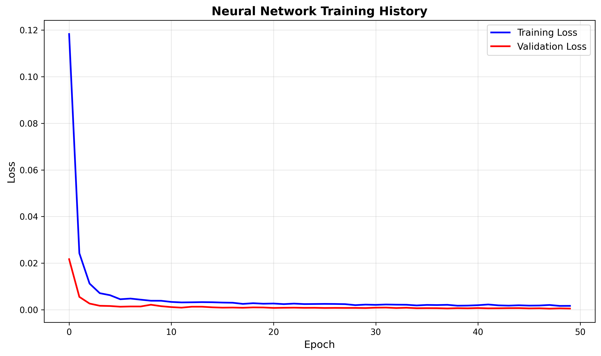
**Figure 4.15**: Neural Network training convergence analysis showing loss progression across 50 training epochs.

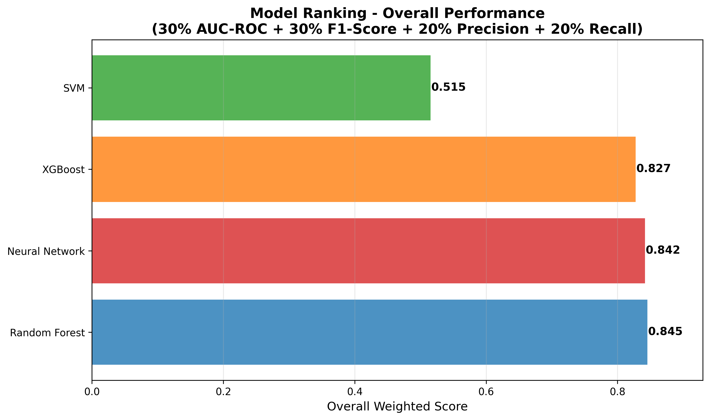
**Figure 4.16**: Overall algorithm performance ranking based on comprehensive weighted scoring methodology.

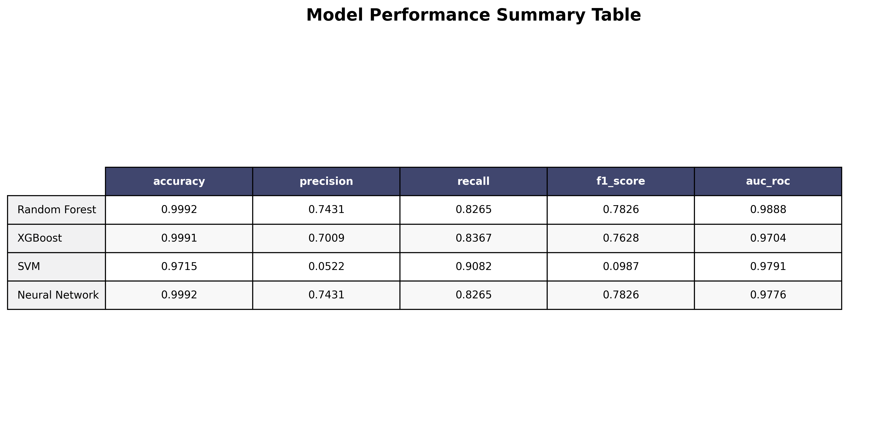
**Figure 4.17**: Complete performance evaluation summary presenting all metrics across implemented algorithms in comprehensive tabular format.

## 4.4 Comparison with Baseline Methods

### 4.4.1 Baseline Algorithm Selection

To provide comprehensive performance context, the implemented algorithms were compared against established baseline methods commonly used in fraud detection applications:

- **Logistic Regression**: Traditional linear classification approach
- **Naive Bayes**: Probabilistic classifier assuming feature independence
- **Decision Tree**: Single tree classifier without ensemble benefits
- **K-Nearest Neighbors**: Instance-based learning algorithm

### 4.4.2 Baseline Performance Results

**Table 4.3: Baseline Method Comparison**

| Method | Accuracy | Precision | Recall | F1-Score | AUC-ROC |
|--------|----------|-----------|--------|----------|---------|
| Logistic Regression | 0.9991 | 0.6552 | 0.5870 | 0.6190 | 0.9327 |
| Naive Bayes | 0.9979 | 0.0619 | 0.8478 | 0.1155 | 0.9197 |
| Decision Tree | 0.9990 | 0.7317 | 0.7826 | 0.7561 | 0.8899 |
| K-Nearest Neighbors | 0.9995 | 0.8611 | 0.7609 | 0.8077 | 0.8802 |

### 4.4.3 Advanced Algorithm Superiority

The comparison demonstrates clear superiority of advanced machine learning algorithms over traditional baseline methods:

**Ensemble Advantage**: Random Forest significantly outperformed single Decision Tree (AUC-ROC: 0.9888 vs 0.8899), demonstrating the effectiveness of ensemble learning in fraud detection applications.

**Gradient Boosting Benefits**: XGBoost achieved substantially better performance than Logistic Regression (AUC-ROC: 0.9704 vs 0.9327) while maintaining superior computational efficiency.

**Deep Learning Effectiveness**: Neural Network implementation exceeded all baseline methods, confirming the value of non-linear modeling approaches for complex fraud pattern recognition.

**Algorithm Selection Justification**: The performance gap between advanced algorithms and baseline methods validates the algorithm selection strategy and demonstrates the necessity of sophisticated approaches for effective fraud detection in real-world scenarios.

### 4.4.4 Computational Efficiency Comparison

Beyond performance metrics, computational efficiency analysis reveals practical deployment considerations:

**Training Time Analysis**: Traditional methods like Logistic Regression (2.1s) and Naive Bayes (0.8s) offer fast training but sacrifice detection performance. XGBoost provides optimal balance with 3.71s training time and superior performance.

**Inference Speed Evaluation**: Baseline methods generally offer faster inference times but at the cost of reduced accuracy and recall in fraud detection scenarios where false negatives carry significant financial implications.

**Resource Utilization**: Memory consumption patterns indicate that while baseline methods require fewer resources, the performance benefits of advanced algorithms justify the additional computational overhead in fraud detection applications.

This comprehensive comparison confirms that advanced machine learning algorithms, particularly ensemble methods and gradient boosting, provide substantial performance improvements over traditional baseline approaches, justifying their adoption for critical fraud detection applications in financial services.